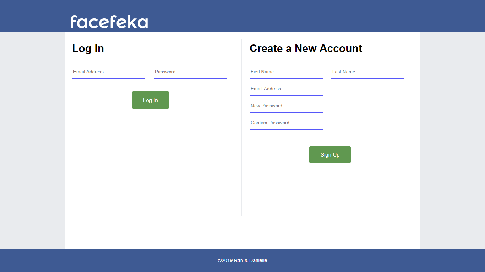
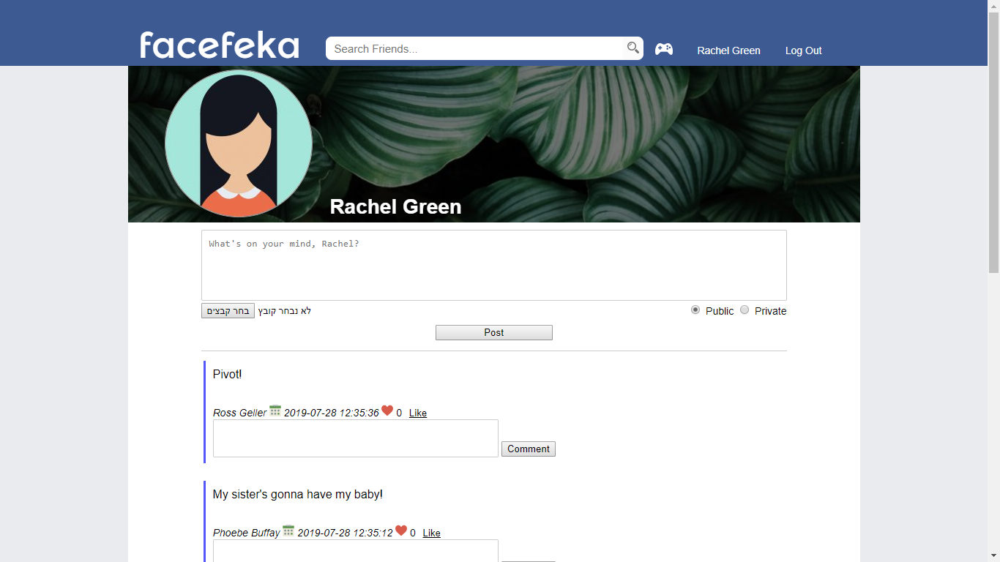
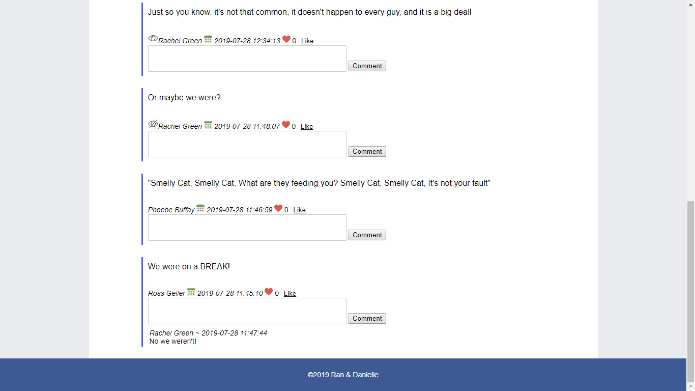
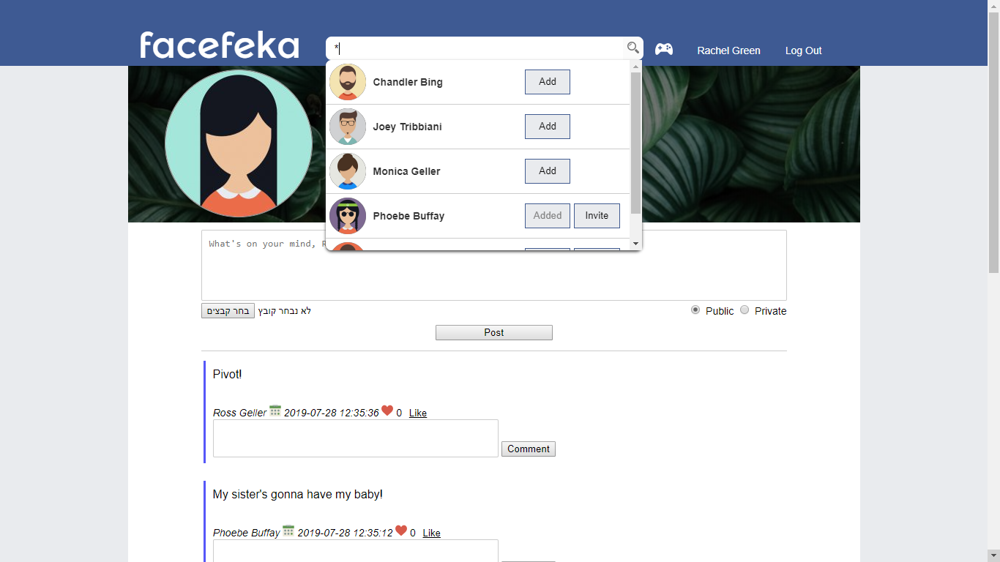
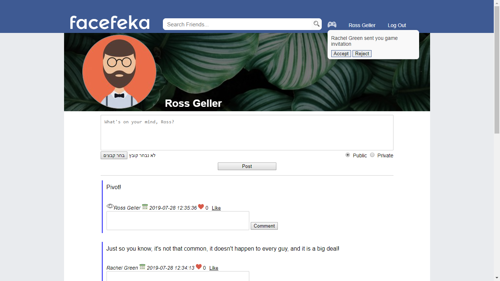
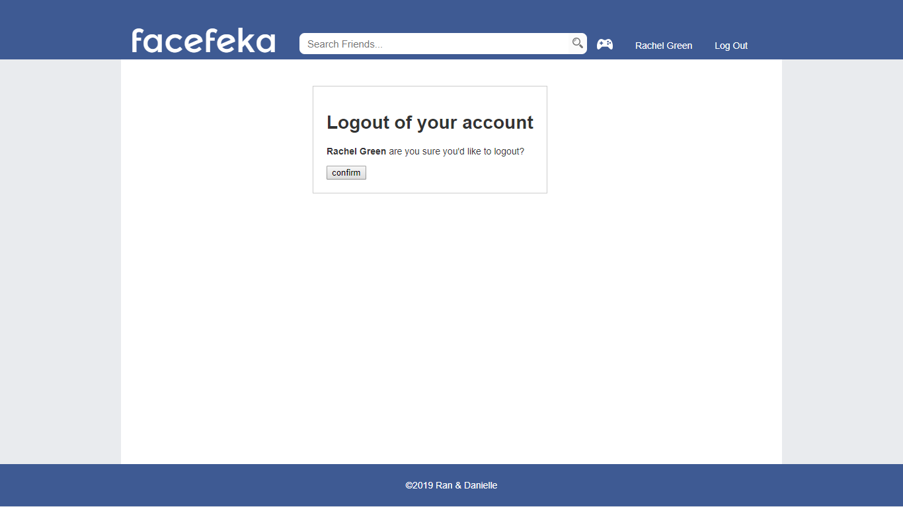

#  FaceFeka
Facebook clone is my final project to Internet Technologies course at Afeka College of Engineering. 

# Features
- Signup
- Login
- Profile page
- Posting text and images
- Private/Public permission to posts (can be changed anytime)
- Liking posts
- Commenting on posts
- Live search bar to find other users who signed up
- Adding other users as friends (No friend request)
- Invite users to play a multiplayer game (FlappyBird)

# Technologies
-	JavaScript
-	Ajax
-	jQuery
-	PHP
-	Apache
-	MySQL
-	CSS
-	HTML

# Screenshots

